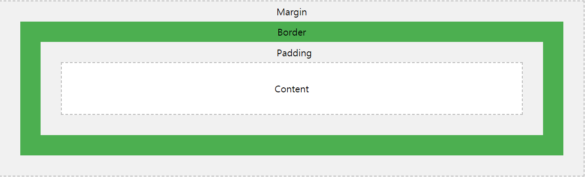
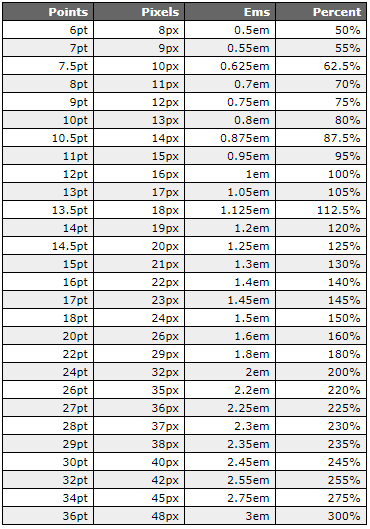

HTML문법은 여기로 [html](./html문법.md)  

 # CSS문법 

## CSS 사용방법

### 외부 CSS가져오기
link 태그를 사용하면 된다.  
```html
<!DOCTYPE html>
<html>
<head>
<link rel="stylesheet" type="text/css" href="mystyle.css">
</head>
<body>
<h1>hihello</h1>
</body>
</html>
```  

### Style태그 이용하기  
style태그를 이용해서 CSS를 사용하면 된다.  
```html
<!DOCTYPE html>
<html>
<head>
<style>
body {
  background-color: linen;
}

h1 {
  color: maroon;
  margin-left: 40px;
}
.classtest{
    color:green;
}
#idtest{
    color:yellow;
}
</style>
</head>
<body>

<h1>This is a heading</h1>
<p>This is a paragraph.</p>
<div class="classtest">Test</div>
<div id="idtest">Test</div>
</body>
</html>
```   
class와 id의 차이점  
id는 고유성이있어서 한가지만 지정할 수 있고  
class는 고유성이 없어서 여러태그에 같은 스타일을 부여할 수 있다.  

### 태그안에다가 직접 넣기
태그안에다가 직접 style태그를 넣을 수 있다.  
```html
<h1 style="color:blue;text-align:center;">태그에 css넣기.</h1>
```  


## width
요소의 너비를 설정할 때 사용한다  
```html
<div style="width:300px; background-color:#AAA">width</div>
```


## height
요소의 높이를 설정할 때 사용한다  
```html
<div style="height:300px; background-color:#AAA">width</div>
```

 ## color 

 ### color 이름
color이름은 다양한 방식으로 지정할 수 있다.  
* 색깔이름 ex) gray,Orange,purple,pink  
* hex값 ex) #fff,#000,#f01736  
* rgb값 or rgba값 ex) rgb(255, 0, 0),rgba(0, 99, 70, 0.4)  
=>여기에서 a는 투명도를 의미한다. 

## Box Model
밑에 나올 margin과 padding 그리고 border는 이러한 느낌을 가지고 있다.  
[](https://www.w3schools.com/css/css_boxmodel.asp)  

 ## border
### Border Style
테두리의 스타일을 설정하는 것이다.  
```html
<div style="border-style: solid;">soild</div>
<div style="border-style: none;">테두리없음</div>
<div style="border-style: groove;">groove</div>
```  


### Border width
테두리의 두께를 설정하는 것이다.  
```html
<div style="border-style: solid; border-width: 5px;">soild</div>
```  


### Border Color
테두리의 색깔을 정하는 것이다. 
```html
<div style="border-style: solid; border-width: 5px; border-color:green">soild</div>
```  


### border-radius
border를 얼마나 round하게 할지 정하는 것이다.  
```html
<div style="border-style: solid; border-width: 5px; border-color:green; border-radius: 15px;">soild</div>
```  


### 위의 요소를 간단하게 줄이기
저렇게 하나하나말고 한번에 간단하게 줄 수 도 있다.  
물론 모든요소를 합칠 수 있는것은 아니다.  
```html
<div style="border: solid 5px green; border-radius: 15px;">soild</div>
```  


## margin,padding
margin:바깥쪽의 여백을 지정하는 요소이다.  
padding:안쪽여백을 지정하는 요소이다.   
margin하고 padding 사용법은 같다.  
```html
<div style="margin-top:60px; margin-left: 80px; margin-right: 150px;   margin-bottom: 100px;  padding-top:60px; padding-left: 80px; padding-right: 150px;   padding-bottom: 100px;  width:200px; height:200px; background-color:pink">
<div style="width:100px; height:100px; background-color:pink"></div>  
</div>  
```  


이것을 한번에 지정할 수 도있다
** 순서는시계방향(위 오른쪽 아래 왼쪽)으로 설정하면 된다. **  
```html
<div style="margin: 75px 50px 75px 100px; padding: 75px 50px 75px 30px; width:200px; height:200px; background-color:pink"><div style="width:100px; height:100px; background-color:lightblue"></div>  </div> 
```
margin:auto를하면 가운데 정렬이 가능하다.   

```html
<div style="margin:auto; width:200px; height:200px; background-color:pink"></div> 
```  
margin:0,auto는 위아래 margin을 0으로 주고 양옆에 auto를 준다는 의미이다.   
padding은 auto가 적용되지 않습니다.  

```html
<div style="margin:0 auto; width:200px; height:200px; background-color:pink"></div> 
```  


## position 
요소의 위치를 나타내 주는것을 말한다.  
### static
position의 기본값, 우리가 보는 흔한 위치값이다.  
```html
<div style="position:static;width:200px; height:200px; background-color:pink"></div>
```


### relative
상대적이며 top,right,botton,left로 위치조정 가능하다.  
```html
<div style="position:relative;width:200px; height:200px; background-color:pink"></div>
<div style="position:relative;width:200px; top: -30px; left: 20px; margin-top:-150px;height:200px; background-color:lightblue"></div>
```


### absolute
absolute는 static 속성을 가지고 있지 않은 부모를 기준으로 움직입니다.  
만약 부모 포지션중 fixed,absolute,relative가 없다면 body가 기준이다.  

```html
<div style="position:absolute; right:0;width:200px; height:200px; background-color:pink"></div>
<div style="position:relative;width:200px; height:200px; background-color:lightblue">
<div style="position:absolute;  right: 0; width:50px; height:50px; background-color:pink"></div>
</div>
```


### fixed
스크롤이 되더라도 같은곳에 위치하게 두는것.  아래 하단에 보면 나와있다.  
```html
<div style="position:fixed;  bottom: 0;   right: 0;width:20px; height:20px; background-color:pink"></div>
```


## display
내용을 보여줄지 말지, 보여주면 어떤식으로 보여줄지 결정하는 요소이다.  

### display:none
내용을 없는걸로 취급하는 속성이다.
```html
<div style="display:none; width:100px; height:100px; background-color:pink"></div>
```

=> 자매품으로 visibility:hidden이 있는데 이 두속성은 차이가 있다.  

```html
<div style="visibility:hidden; width:100px; height:100px; background-color:pink"></div>
```    

 visibility:hidden은 공간까지 숨겨주지않고 공간은 남겨져있지만  
 display:none은 공간까지 숨겨준다.  

### display:inline
inline방식으로 나열한다는 속성이다.  
div에다가 크기를 주면 적용이 안되는거 같으니 그것은 주의  
```html
<div style="display:inline">inline1</div>
<div style="display:inline">inline2</div>
```  

### display:block
block방식으로 나열한다는 속성이다.  
```html
<span style="display:block">block1</span>
<span style="display:block">block2</span>
```  


## float
float는 정렬하는 속성이다.  

### float:left
요소를 왼쪽에다가 배치하는 속성이다  

```html
<p><div style="float:left; width:100px; height:100px; background-color:pink"></div>
HTML CSS JAVASCRIPT REACT ANGULR VUE SPRING PYTHON LINUX C C++ C# GO JAVA PHP R VISULA BASIC
ASSEMBLY ASP PORTLAN COBOL SWIFT RUBY SCALA PERL MATRAB HTML CSS JAVASCRIPT REACT ANGULR VUE SPRING PYTHON LINUX C C++ C# GO JAVA PHP R VISULA BASIC ASSEMBLY ASP PORTLAN COBOL SWIFT RUBY SCALA PERL MATRAB <</p>
```  


### float:right
요소를 오른쪽에다가 배치하는 속성이다  

```html
<p><div style="float:right; width:100px; height:100px; background-color:pink"></div>
HTML CSS JAVASCRIPT REACT ANGULR VUE SPRING PYTHON LINUX C C++ C# GO JAVA PHP R VISULA BASIC
ASSEMBLY ASP PORTLAN COBOL SWIFT RUBY SCALA PERL MATRAB HTML CSS JAVASCRIPT REACT ANGULR VUE SPRING PYTHON LINUX C C++ C# GO JAVA PHP R VISULA BASIC ASSEMBLY ASP PORTLAN COBOL SWIFT RUBY SCALA PERL MATRAB <</p>
```  


### clear
float속성을 해제하는 속성이다.  
```html
<div style="float:left; width:100px; height:100px; background-color:pink"></div>
<div style="clear:left ; width:100px; height:100px; background-color:lightblue"></div>
```


## ALIGN
정렬하는 속성이다, 이전에다룬 margin:auto와 후에 다룰 text-center는 따로 다루지 않겠다.  

### 이미지 가운데 정렬   

```html

```


### 글자 세로 정렬 
이건 따로 없고 padding으로 수치를 조절하면 된다. 
```html
<div style="padding: 70px 0; border: 3px solid green;">글자 수직정렬</div>
```


### 요소 정중앙 정렬

```html  
<div style=" height: 200px;
width: 200px;
  position: relative;
  border: 3px solid green; ">
  <div style=" margin: 0;
  position: absolute;
  top: 50%;
  left: 50%;
  -ms-transform: translate(-50%, -50%);
  transform: translate(-50%, -50%);
height:100px; width:100px; border: 3px solid green; "></div>
</div>
```

이런식으로 해주면 된다.  


 ## background 

### background-color  
 배경화면의 색깔을 설정해주는 요소이다.  
 ```html
 <div style="background-color:pink">
 background-color
</div>
 ```  


### background-image 
 배경화면의 이미지를 결정해주는 요소이다
 ```html
 <div style="background-image :url('./test.jpg');  height:300px">
 background-color
</div>
 ```  
  

### background-size
배경화면의 사이즈를 결정해준다  
```html
<div style="background-image :url('./test.jpg'); height:300px; background-size:300px;"></div>
```  


### background-repeat 
배경을반복해서 보여줄지 아닐지를 결정해주는것이다.  
반복안할경우  
```html
<div style="background-image :url('./test.jpg'); height:300px; background-size:300px; background-repeat:no-repeat"></div>
```  

 
좌우로만 반복하게 설정한 경우  
```html
   <div style="background-image :url('./test.jpg'); height:300px; background-size:300px; background-repeat: repeat-x"></div>
 ```


위아래로만 반복되게 설정한 경우  
```html
   <div style="background-image :url('./test.jpg'); height:300px; background-size:300px; background-repeat: repeat-y"></div>
```  


 ### background-position
 배경화면이 배치될 위치를 정한다. botton,top,right,left 이런식으로 정할 수있다.  
```html
 <div style="background-image :url('./test.jpg'); height:300px; background-size:300px; background-repeat:no-repeat;background-position: right top; "></div>   
```  


 ### background
 지금까지 나온 요소를 길게가 아닌 짧게 표현할 수 도 있다.  
 ```html
 <div style="background:url('./test.jpg') 300px no-repeat right top; height:300px; background-size:300px;"></div> 
 ```  

  ## TEXT
  글자에 관한 설정을 하는 요소이다.
### color  
글자색을 설정해주는 요소이다.  
 ```html
 <p style="color:#ff0">
 background-color
</p>
```  
 <p style="color:#f00">
 background-color
</p>  

### text-align
글자의 위치를 설정해주는 요소이다.  
center:글자를 가운데에 둔다.  
left:글자를 왼쪽에 둔다.  
right: 글자를 오른쪽에 둔다.  

center
```html
<div style="text-align:center">Center</div>
```  


left
```html
<div style="text-align:left">left</div>
```  


right
```html
<div style="text-align:right">right</div>
```  


## font
font에 관한 설정을 하는 CSS이다.  

### font-family
폰트를 결정하는 것이다.  
```html
<div style="font-family: 'Lucida Console';">test</div>
```  


### font-size  
폰트의 크기를 결정하는 것이다.  
```html
<div style="font-size: 30px;">test</div>
```  

폰트단위<br>
1.px:픽셀로 측정한 폰트크기,크기가 고정적임.(주로 컴퓨터에서 사용이됨.)<br>
2.pt:흔히 아는 폰트크기,크기가 상대적임(주로 인쇄매체에서 사용이됨)<br>
3.em:웹문서에서도 사용되는 단위로 컴퓨터 외 모바일 등 다른장치에서도 크기조정 가능. 상대적인 크기임<br>
font 상대적 크기  

[](https://reeddesign.co.uk/test/points-pixels.html)  

## Table

### table border

markdown에서는 제대로먹히지 않으니 예시는 따로 링크를 겁니다.  
[Table](./HTMLTEST.html)  

```html
   <table style="  border: 1px solid black;  border-collapse: collapse;">
        <tr>
          <th style="  border: 1px solid black;">Firstname</th>
          <th style="  border: 1px solid black;">Lastname</th>
        </tr>
        <tr>
          <td style="  border: 1px solid black;">Peter</td>
          <td style="  border: 1px solid black;">Griffin</td>
        </tr>
        <tr>
          <td style="  border: 1px solid black;">Lois</td>
          <td style="  border: 1px solid black;">Griffin</td>
        </tr>
      </table>
```  

### 세로줄 없애기

```html
<table>
        <tr>
          <th style="    border-bottom: 1px solid #ddd; ">Firstname</th>
          <th style="    border-bottom: 1px solid #ddd;">Lastname</th>
        </tr>
        <tr>
          <td style="   border-bottom: 1px solid #ddd;">Peter</td>
          <td style="   border-bottom: 1px solid #ddd;">Griffin</td>
        </tr>
        <tr>
          <td style=" border-bottom: 1px solid #ddd;">Lois</td>
          <td style="   border-bottom: 1px solid #ddd;">Griffin</td>
        </tr>
      </table>
```  

### Hover 효과 넣기

```html
        <style>
          tr.hovertest:hover {background-color:#000;}
        </style>
   <table>
        <tr class="hovertest">
          <th style="    border-bottom: 1px solid #ddd; ">Firstname</th>
          <th style="    border-bottom: 1px solid #ddd;">Lastname</th>
        </tr>
        <tr class="hovertest">
          <td style="   border-bottom: 1px solid #ddd;">Peter</td>
          <td style="   border-bottom: 1px solid #ddd;">Griffin</td>
        </tr>
        <tr class="hovertest">
          <td style=" border-bottom: 1px solid #ddd;">Lois</td>
          <td style="   border-bottom: 1px solid #ddd;">Griffin</td>
        </tr>
      </table>
```  

### 왔다갔다 효과넣기 
```html
          tr.Stripedtest:nth-child(even) {background-color: #f2f2f2;}
<table>
            <tr class="Stripedtest">
              <th style="    border-bottom: 1px solid #ddd; ">Firstname</th>
              <th style="    border-bottom: 1px solid #ddd;">Lastname</th>
            </tr>
            <tr class="Stripedtest">
              <td style="   border-bottom: 1px solid #ddd;">Peter</td>
              <td style="   border-bottom: 1px solid #ddd;">Griffin</td>
            </tr>
            <tr class="Stripedtest">
              <td style=" border-bottom: 1px solid #ddd;">Lois</td>
              <td style="   border-bottom: 1px solid #ddd;">Griffin</td>
            </tr>
          </table>
```  

## form
앞전에 한것과 똑같은데. 

```css
input[type=text] {
  width: 100%;
  padding: 12px 20px;
  margin: 8px 0;
  box-sizing: border-box;
}
```  

이런식으로 적용하면 된다.  


