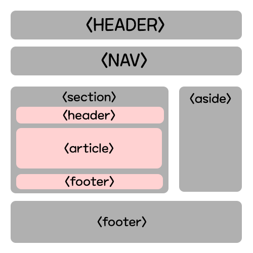

CSS문법은 여기로 [css](./css문법.md)

 # HTML 문법
 ## HTML5 설정
 html5를 사용하려면 문구 제일 위에다가 
 ```html 
 <!doctype html>
 ```  
 이라고 적으면 된다.  
 그럼 html5를 사용할 준비가 되었다는 뜻이다.  

## HTML기본틀
```html
<!DOCTYPE HTML>
<html>
    <head>
    </head>
    <body>
    </body>
</html>
```  
```html

<head>
</head>

```  
이태그는 html파일에 대한 설정이나 css,javascript 같은 코드가 들어가는 곳이다

```html
<body>
</body>
```  
이태그에는 html파일이 웹페이지가 보여지는 부분을 태그로써 구현하는 곳이다.  

## 주석
주석을 달아줄 때는 이것을 사용한다.
```html
<!--여기에다가 주석문구를 넣어주세요-->
```

## head태그
### link태그
css 파일을 연결하는 태그이다  
기본 사용방식은 이러하다
```html
<link rel="stylesheet" type="text/css" href="CSSTEST.css">
```  
### meta 태그
문서의 정보를 담고있는 태그이다.
```html
 <meta charset="UTF-8">
  <meta name="viewport" content="width=device-width, initial-scale=1.0">
```  
여러가지 사용방법이 있겠지만, 가장 보편적으로 사용하는것은 저것이다.  
왠만하면 저둘은 사용하는것을 추천한다.  
```html
 <meta charset="UTF-8">
```  
이것은 렌더링을 UTF-8로 해준다는 거고  
```html
  <meta name="viewport" content="width=device-width, initial-scale=1.0">
```  
이것은 페이지를 화면크기에 맞게 보여준다 대충 이러한 의미를 가진 태그이다.  
속성에대해서 몇가지 설명하면..  
width=device-width :페이지의 너비를 기기의 스크린 너비로 설정  
initial-scale=1.0 : 원래의 크기로 사용한다는 의미이다.  
minimum-scale :축소했을때의 최소로 축소 가능한 수치  
maximum-scale : 확대했을때의 최대로 확대가능한 수치   
user-scalable : 사용자의 확대/축소 기능을 설정, 기본값은 yes이다.    
### style태그
```html
<style>
    p {color:red}
</style>
```  
html 파일 안에다가 css 코드를 넣는 태그이다.  
자세한 css문법은 CSS편에서 다룰 예정이다.

### script태그
```html
<script>
</script>
```  
script코드를 넣는 태그이다. 여기에다가 script 코드를 넣어주면 된다.  

### title태그
웹페이지의 제목을 정해주는 태그이다.  
```html
<title>
</title>
```  

## body태그
### 대부분 태그에 들어가는 요소
1. style: css를 적용시켜주는 요소이다.  
2. class: 외부의 css코드에서 class로 정의된 요소를 적용시켜준다. css편에서 더 자세하게 다룰 예정이다.  
3. id:그 태그만의 고유의 이름을 가지게 하는 것이다.  

### a태그
HTML에서 가장 많이 사용하는 태그중 하나가 a태그이다.  
웹사이트에 링크를 걸어주는 기능을 한다.
```html
<a href="링크주소">링크를 클릭할 문구</a> 
```   
링크를 입력할 때 에는 반드시 https:// 를 입력해 주어야한다.  
<a href="https://www.google.com">a태그</a>  

### br태그
줄바꿈을 하는 태그이다.  
```html
<br/>
```  
끝에 슬래시를 치는경우도 있고 안치는경우도 있다.  

### img 태그 
이미지를 불러오는 태그이다. 이런식으로 사용하면 된다.
```html

```  
<br>
width와 height속성이 없으면 이미지 원본크기가 그대로 나온다.  
 

### p 태그 
문단을 구분해주는 태그이다.  
```html
<p>
</p>
```  
### h1~h6태그
글자 크기를 조정하는 태그입니다.  
```html
<h1>h1</h1>
<h2>h2</h2>
<h3>h3</h3>
<h4>h4</h4>
<h5>h5</h5>
<h6>h6</h6>
```  


### span 태그 
inline 방식으로 배열이되는 코드이다.  
```html
<span>글자아무거나</span>
```  

### div 태그 
block 방식으로 배열이되는 코드이다. 진짜 자주 사용되는 코드이다.  
어떠한 요소를 감쌀때도 주로 사용한다.  
```html
<div>글자아무거나</div>
```  

### inline과 block의차이
inline은 옆으로 늘여놓는거고 block는 위아래로 쌓는다고 생각하면 될것이다.  
예시를 들면 이러하다.
<div style="background-color:pink">div 태그사용</div>
<div style="background-color:blue; color:white">div 태그사용</div>
<span style="background-color:pink">span 태그사용</span>
<span style="background-color:blue; color:white">span 태그사용</span>

### Sementic 태그
레이아웃만을 위해 사용되는 태그이다. 태그자체에는 큰 의미가있지는 않다.  
기능은 DIV하고 같다.  


### header태그 (sementic 태그1)
```html
<header>  
</header>
```  
보통 위에 어느페이지에서나 보여줘야할 부분 ex)로고 같은데에서 사용한다.  

### nav태그 (sementic 태그2)
```html
<nav>  
</nav>
```  
쉽게 생각하면 네비바라고 생각하면 된다.  

### aside태그 (sementic 태그3) 
```html
<aside>  
</aside>
```  
사이드에 위치한 공간을 의미한다.  

### section태그 (sementic 태그4) 
```html
<section>  
</section>
```  
여러한 내용들을 감싸는 공간을 의미한다.  

### article 태그 (sementic 태그5) 
```html
<article>  
</article>
```  

핵심적인 내용을 넣을때 사용한다.  

### footer 태그 (sementic 태그6) 
```html
<footer>  
</footer>
```  
페이지 제일 하단부분을 작업할 때 사용한다.  

### li 태그
목록리스트이다 주로 ul태그와 ol태그와같이쓴다. 
```html
<li>리스트1</li>
```

### ol 태그
순서있는 목록을 뽑아주는 태그이다.  
```html
<ol>
<li>리스트1</li>
<li>리스트2</li>
<li>리스트3</li>
</ol>
``` 
<ol>
<li>리스트1</li>
<li>리스트2</li>
<li>리스트3</li>
</ol>

### ul 태그
순서없는 목록을 뽑아주는 태그이다.  
```html
<ul>
<li>리스트1</li>
<li>리스트2</li>
<li>리스트3</li>
</ul>
``` 
<ul>
<li>리스트1</li>
<li>리스트2</li>
<li>리스트3</li>
</ul>

### form 태그 
양식을 만들어주는 태그이다.  
```html
<form action="/action_page.php" method="get">
</form>
```  
여기안에 form요소를 넣으면 된다.  
action:form을 작성하고 넘겨줄 페이지. 
method:어떤 방식으로 넘겨줄지 정해주는 것. get방식과 post방식이 있다.  

 ### input 태그 (form 태그1)
사용자가 데이터를 입력할 때 사용하는 코드  
기본 방식은 이렇다.  
```html
<input type="text" name="test" value="test">
```  
type:데이터를 입력받을 방식  
name:서버로 전달될 이름  
value:사용자 초기값  
type종류에는 여러가지가 있다.  
#### text 
기본 text를 입력하는 방식.  
```html
<input type="text" name="test" value="test">
```  


#### password
비밀번호를 입력할 때 사용하는 방식  
```html
<input type="password" name="password" value="password">
```  


#### email
이메일을 입력할 때 사용하는 방식  
```html
<input type="email" name="email" value="email@emailtest.com">
```  


#### radio
라디오버튼을 생성한다.  
```html
<input type="radio" name="fruit" value="사과">사과  
<input type="radio" name="fruit" value="바나나" checked>바나나  
```  
이런식으로 사용해주면 된다.  
checked: 미리 체크한다는 설정.  


#### checkbox
체크박스버튼을 생성한다.  
```html
<input type="checkbox" name="fruit" value="사과">사과  
<input type="checkbox" name="fruit" value="바나나" checked>바나나  
```  
이런식으로 사용해주면 된다.  
checked: 미리 체크한다는 설정.  


#### file
file을 가져오는 버튼을 생성한다.  
```html
<input type="file" name="file">
```  


#### submit
file을 가져오는 버튼을 생성한다.  
```html
<input type="submit" value="버튼이름">
```  


 ### select 태그 (form 태그2) 
 항목을 선택할 때 사용하는 태그이다.  
 option태그하고 같이 사용한다.  
 ```html
 <select>
  <option value="one">하나</option>
  <option value="two">둘</option>
  <option value="three">셋</option>
  <option value="four">넷</option>
</select>
 ```  


### textarea태그 (form 태그3) 
긴 내용을 입력할 때 사용하는 태그이다.  
```html
<textarea rows="4" cols="50">
여기에다가 내용을 입력하시면 됩니다.
</textarea>
```  
row:세로길이  
col:가로길이  

<textarea rows="4" cols="50">
여기에다가 내용을 입력하시면 됩니다.
</textarea>  

### Table 태그
테이블을 만들어주는 태그이다. 기본적인 틀은 이것이다.  
```html
<table>
    </table>
```  

### tr태그
행을 설정해주는 태그이다.  
```html
<table>
    <tr>
        </tr>
    </table>
``` 


### td태그
열을 설정해주는 태그이다.  
colspan:가로로 병합  
rowspan:세로로 병합  
```html
<table>
        <tr>
            <td rowspan="3">0</td>
        <td colspan="2">0</td>
        </tr>
    <tr>
     
        <td>1</td>
        <td>2</td>
        </tr>
            <tr>
        <td>3</td>
        <td>4</td>
        </tr>
    </table>
```  

### th태그
태그 제목을 설정해주는 태그이다.
```html
<table>
        <tr>
        <th>odd</th>
        <th>even</th>
        </tr>
        <tr>
            <td rowspan="3">0</td>
        <td colspan="2">0</td>
        </tr>
    <tr>
        <th>  </th>
        <td>1</td>
        <td>2</td>
        </tr>
            <tr>
        <td>3</td>
        <td>4</td>
        </tr>
    </table>
```  

<table>
        <tr>
        <th>  </th>
        <th>odd</th>
        <th>even</th>
        </tr>
             <tr>
            <td rowspan="3">0</td>
        <td colspan="2">0</td>
        </tr>
    <tr>
        <td>1</td>
        <td>2</td>
        </tr>
            <tr>
        <td>3</td>
        <td>4</td>
        </tr>
    </table>  


